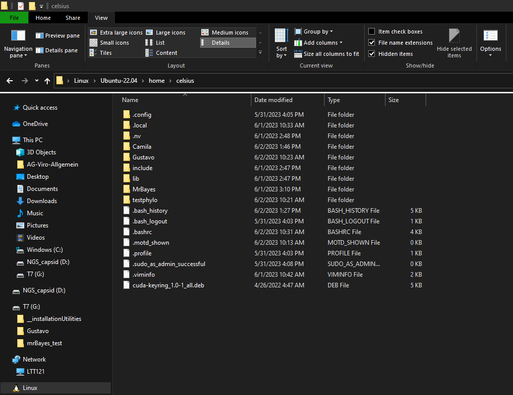
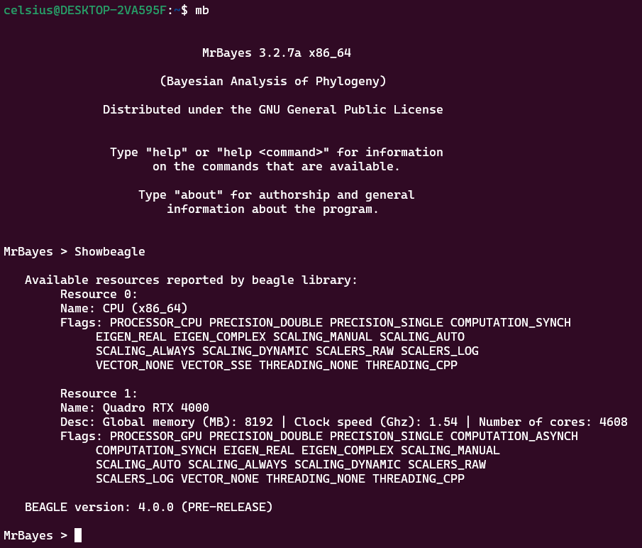

# Running Mr Bayes on the Lab's Server

## What

This document describes how to efficiently run Mr Bayes using Beagle to speed up the likelihood calculations in our local Server.

## Why

Running Mr. Bayes on our server has the advantage of using beagle library running in a well-served hardware configuration. It allows for more efficient work on Bayesian phylogenetic tree estimations and up to 50X speedup when working with codon or amino acid models.

That is why we'll use Beagle GPU when working with ***long** amino acid or codon* models and Beagle CPU plus SSE instructions for Intel chips when working with *nucleotide or **short** amino acid/codon* models.

## How 

Prepare a [NEXUS file](https://en.wikipedia.org/wiki/Nexus_file) from the multiple sequence alignment you have. One could create one by converting a MSA fasta file using MEGA ou Geneious softwares.

**Tip**: Partial gap deletion is recommended only if you are sure that your gaps are not due experimental artifacts, otherwise use complete deletion for generate a Mr. Bayes input.

Create a folder for your project inside WSL's directories, specifically in the /home/celcius. Acessing by Windows File Explorer, it will be located like showed above:

If your folder is named 'my_folder_name', the location would be in windows like this:

In Mr. Bayes from WSL we will use the same path, but written in unix style as follows:

    /home/celsius/my_folder_name

Therefore, your nexus file path is:

    /home/celsius/my_folder_name/my_nexus_file.nex
We will use this address later.

Start a WSL session with Ubuntu 22 just opening the `Windows Terminal` or the `Ubuntu 22.04` applications. 

In the opened terminal, type `mb` to start Mr. Bayes. If you want to verify if everything is running well, type in Mr. Bayes interpreter:

    Showbeagle

A resource description like this should appear:

### Configuring Beagle Library Usage
Then, if your sequences are **NUCLEOTIDES** or **short** amino acids/codon models, enter the following command:

    set Usebeagle=Yes Beagledevice=CPU Beagleprecision=Single Beaglethreadcount=99 Beaglesse=yes

If your sequences are **long AMINO ACIDS** our you are using a **Codon Substitution Model** for **long** segments, enter this command:

    set Usebeagle=Yes Beagledevice=GPU Beagleprecision=Single Beaglethreadcount=99

After that, proceed with usual execution.

**Nucleotide settings**

    exe /home/celsius/my_folder_name/my_nexus_file.nex
    outgroup XX
    lset rates=invgamma nst=6 
    prset brlenspr=unconstrained:exponential(10.0) shapepr=exponential(10.0)
    mcmc ngen=2000000 samplefreq=100 printfreq=1000 starttree=random

**Amino acid settings**

    exe /home/celsius/my_folder_name/my_nexus_file.nex
    outgroup XX
    prset aamodelpr=fixed(WAG)
    prset brlenspr=unconstrained:exponential(10.0) shapepr=exponential(10.0)
    mcmc ngen=2000000 samplefreq=100 printfreq=1000 starttree=random

Where XX is the number of your outgroup taxon.

## Results

An interactive Mr. Bayes session using server resources will start and your result output files will be placed in the same folder your nexus file was placed.

