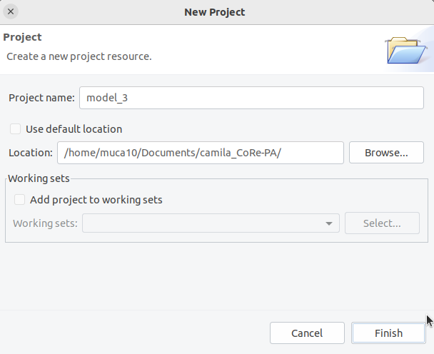

# Running CoRe-PA

## What

Coevolution is a reciprocal process whereby the evolutionary changes in one species can influence the evolution of another species, often leading to a tightly intertwined relationship. By reconstructing the phylogenetic history of the interacting species, researchers can discern patterns of coevolutionary interactions over time and understand the evolutionary processes that have shaped their mutual adaptations, such as host switch, cospeciation, sorting, duplication, etc. Phylogenetic estimations allow the identification of key events, such as speciation, divergence, and host shifts, which provide a framework for deciphering the mechanisms driving coevolutionary dynamics.

## Why

*In silico* methods usually are classified as those methods that i) find congruence between host and parasite phylogenies by identifying symmetries in genetic distances and ii) those methods that compare tree topological features between hosts and parasites to infer nature and frequency of different evolutionary events. 

While the first group of tools provide a more statistical way to describe a observed co-evolutionary relationship, the second group of tools, in which CoRe-PA is included, provide us a putative evolutionary history of our parasites.

## How

To infer co-evolution using CoRe-PA, you must already have two phylogenetic trees completed using programs such as Mr. Bayes, Beast, or IQTree. One tree is for the host (human, primates, mammals, etc.) and the other is for the parasites (viruses, bacteria, etc.). Once you have the trees in [newick format](https://evolution.genetics.washington.edu/phylip/newicktree.html), you need to erase all node information, such as branch lengths or posterior probabilities/bootstraps, because CoRe-PA compares only topological parameters between these two trees. You need also a file describing the relation between the hosts and parasites.

### Prerequisites

Three files and four programs:

- A phylogeny estimated from a proper multiple sequence alignment of viral segments of interest.
- A phylogeny estimated from a proper multiple sequence alignment of host sequences that could be used as evolutionary markers, such as cytochrome mitochondrial genes.
    - To accomplish the previous 2 requirements, you need to know:
        - How to obtain your sequences
        - How to correctly perform a multiple sequence alignment (mafft or clustal w, depending of the usage of nt. or a.a.)
        - How to estimate a phylogeny from this multiple sequence alignment (using iqtree or mrBayes + treeAnotator, etc)
        - Obtain your trees in newick format (To do so, one could import the generated tree into FigTree software and export the tree as ‘.nex’ or ‘.nwc’)
- A file describing association between Parasites and their respective Hosts.
- Java Virtual Machine needs to be correctly installed in your machine. Use this [link to download and install Java](https://www.java.com/en/download/help/download_options.html).
- Download [CoRe-PA](http://pacosy.informatik.uni-leipzig.de/58-1-Downloads.html), both GUI application and the randomization version RND (which will be executed as a Command Line program).
- [R/Rstudio](https://posit.co/products/open-source/rstudio/).

File formats will be specified above.

### Preparing the trees

**Making a cladogram from phylogenetic tree in newick format**

A tree in the newick format looks like this example:

```
(((((((((Hepacivirus_C_5a_Y13184:0.166702,((Hepacivirus_C_1a_AF011751:0.073518,Hepacivirus_C_1b_D90208:0.063732):0.058171,Hepacivirus_C_4a_GU814265:0.122012):0.01479):0.021067,((Hepacivirus_C_6a_Y12083:0.124876,Hepacivirus_C_6g_D63822:0.10731):0.042789,Hepacivirus_C_8_MH590698:0.142083):0.046969):0.028214,(Hepacivirus_C_3a_D17763:0.090177,Hepacivirus_C_3k_D63821:0.093632):0.088085):0.055719,(Hepacivirus_C_2b_D10988:0.074397,Hepacivirus_C_2a_D00944:0.075391):0.122579):0.050258,Hepacivirus_C_7a_EF108306:0.136575):0.286405,Hepacivirus_A_KP325401:0.376197):0.302053,(Hepacivirus_M_KC796078:0.361879,Hepacivirus_K_KC796074:0.364972):0.193393):0.263697,((((Hepacivirus_L_KC796077:0.487971,(macaque_Hepacivirus_OX394158:0.242925,(Hepacivirus_D_NC_074786:0.018276,Hepacivirus_D_NC031950:0.019188):0.202414):0.433819):0.084784,((((Hepacivirus_B_AB630358:0.002999,Hepacivirus_B_NC001655:6.21E-4):0.001308,Hepacivirus_B_NC038426:0.003767):0.180463,((314_complete_05052350thr:0.004094,312_complete_280423:0.002952):0.088644,(215_complete_280423:0.084911,216_11maio_complete:0.057049):0.026381):0.11396):0.418303,Hepacivirus_N_KP641127:0.716306):0.116584):0.065898,(((Hepacivirus_G_NC025672:0.359325,(Hepacivirus_E_KC815310:0.204947,(Hepacivirus_F_OV121129:0.027889,Hepacivirus_F_NC038427:0.026183):0.226936):0.159449):0.094487,((Sloth_Hepacivirus_MH844500:0.277376,Hepacivirus_P_NC_040815:0.214012):0.119287,Ringtail_Hepacivirus_MZ393517:0.39016):0.100453):0.070303,(Lemur_Hepacivirus_MH824539:0.431064,Hepacivirus_H_NC025673:0.432448):0.083147):0.280469):0.09368,Hepacivirus_I_NC038428:0.621894):0.188924):0.171001,Hepacivirus_J_NC038429:0.654694,Shark_Hepacivirus_KR902729:0.848426);
```

One could simply manually remove the numerical values from shorter trees, but for longer trees, it becomes impractical and error-prone. Instead, it is recommended to use proper text/script editors such as ‘Notepad++’ or ‘gedit’, and apply the following regular expression to automatically "find and replace" the exact pattern we want to erase.

This is the regular expression that we use to erase branch information, by replacing this patter with nothing:

```
:[0-9]+(\.[0-9]+)?
```

On your text editor, find the ‘Find and Replace’ tool and make sure you selected a box called ‘Regular Expression’ or ‘ReGex’.

   

Then, replacing all with nothing, the resulting cladogram will be:

```
(((((((((Hepacivirus_C_5a_Y13184,((Hepacivirus_C_1a_AF011751,Hepacivirus_C_1b_D90208),Hepacivirus_C_4a_GU814265)),((Hepacivirus_C_6a_Y12083,Hepacivirus_C_6g_D63822),Hepacivirus_C_8_MH590698)),(Hepacivirus_C_3a_D17763,Hepacivirus_C_3k_D63821)),(Hepacivirus_C_2b_D10988,Hepacivirus_C_2a_D00944)),Hepacivirus_C_7a_EF108306),Hepacivirus_A_KP325401),(Hepacivirus_M_KC796078,Hepacivirus_K_KC796074)),((((Hepacivirus_L_KC796077,(macaque_Hepacivirus_OX394158,(Hepacivirus_D_NC_074786,Hepacivirus_D_NC031950))),((((Hepacivirus_B_AB630358,Hepacivirus_B_NC001655E-4),Hepacivirus_B_NC038426),((314_complete_05052350thr,312_complete_280423),(215_complete_280423,216_11maio_complete))),Hepacivirus_N_KP641127)),(((Hepacivirus_G_NC025672,(Hepacivirus_E_KC815310,(Hepacivirus_F_OV121129,Hepacivirus_F_NC038427))),((Sloth_Hepacivirus_MH844500,Hepacivirus_P_NC_040815),Ringtail_Hepacivirus_MZ393517)),(Lemur_Hepacivirus_MH824539,Hepacivirus_H_NC025673))),Hepacivirus_I_NC038428)),Hepacivirus_J_NC038429,Shark_Hepacivirus_KR902729);
```

This must be done for both parasite and host trees.

**Formatting taxa labels (optional)**

Additionally, in front of each Parasite name in the tree, we add a ‘P’ letter. To do so, we use the following regular expression

```
([0-9a-zA-Z]+)
```

to make the pattern selection and the following regular expression to replace

```
P\1
```

   

Then the previous tree will look like this one:

```
(((((((((PHepacivirus_PC_P5a_PY13184,((PHepacivirus_PC_P1a_PAF011751,PHepacivirus_PC_P1b_PD90208),PHepacivirus_PC_P4a_PGU814265)),((PHepacivirus_PC_P6a_PY12083,PHepacivirus_PC_P6g_PD63822),PHepacivirus_PC_P8_PMH590698)),(PHepacivirus_PC_P3a_PD17763,PHepacivirus_PC_P3k_PD63821)),(PHepacivirus_PC_P2b_PD10988,PHepacivirus_PC_P2a_PD00944)),PHepacivirus_PC_P7a_PEF108306),PHepacivirus_PA_PKP325401),(PHepacivirus_PM_PKC796078,PHepacivirus_PK_PKC796074)),((((PHepacivirus_PL_PKC796077,(Pmacaque_PHepacivirus_POX394158,(PHepacivirus_PD_PNC_P074786,PHepacivirus_PD_PNC031950))),((((PHepacivirus_PB_PAB630358,PHepacivirus_PB_PNC001655E-P4),PHepacivirus_PB_PNC038426),((P314_Pcomplete_P05052350thr,P312_Pcomplete_P280423),(P215_Pcomplete_P280423,P216_P11maio_Pcomplete))),PHepacivirus_PN_PKP641127)),(((PHepacivirus_PG_PNC025672,(PHepacivirus_PE_PKC815310,(PHepacivirus_PF_POV121129,PHepacivirus_PF_PNC038427))),((PSloth_PHepacivirus_PMH844500,PHepacivirus_PP_PNC_P040815),PRingtail_PHepacivirus_PMZ393517)),(PLemur_PHepacivirus_PMH824539,PHepacivirus_PH_PNC025673))),PHepacivirus_PI_PNC038428)),PHepacivirus_PJ_PNC038429,PShark_PHepacivirus_PKR902729);
```

**Analogously, these two steps must be applied for the host sequence. Remember to chance the last regular expression from P\1 to H\1 in order to correctly rename the host taxa.**

### Making a PHI file with Parasite-Host associations.

These associations need to be formatted as the following structure:

```
PHI
	P-parasite1 H-host1,
	P-parasite2 H-host2,
	P-parasite3 H-host3,
				.
				.
				.
	P-parasiteN H-hostK
;
```

```
PHI # header structure
(tab)H{parasite anme}(space){host name}, #coma
(tab)H{parasite anme}(space){host name}, #coma
(tab)H{parasite anme}(space){host name}, #coma
...
...
...
(tab)H{parasite anme}(space){host name} #no coma at the last one
; (dot coma to end)
```

An example would be:

```
PHI
	Hepacivirus_J_NC038429 Mglareolus,
	Hepacivirus_K_KC796074 Mvittatus,
	Hepacivirus_M_KC796078 Omartiensseni,
	Hepacivirus_A_KP325401 Ecaballus,
	Hepacivirus_C_1a_AF011751 Hsapiens,
	Hepacivirus_I_NC038428 Rpumilio,
	Hepacivirus_N_KP641127 Btaurus,
	Hepacivirus_B_NC038426 Smystax,
	Hepacivirus_B_NC001655 Smystax,
	312_complete_280423 Caurita,
	314_complete_05052350thr Caurita,
	215_complete_280423 Cjacchus,
	216_11maio_complete Cjacchus,
	macaque_Hepacivirus_OX394158 Mfascicularis,
	Hepacivirus_D_NC031950 Cguereza,
	Hepacivirus_D_NC_074786 Cguereza,
	Hepacivirus_L_KC796077 Mvittatus,
	Hepacivirus_G_NC025672 Rnorvegicus,
	Hepacivirus_F_NC038427 Mglareolus,
	Hepacivirus_E_KC815310 Pmaniculatus,
	Hepacivirus_P_NC_040815 Cdauricus,
	Sloth_Hepacivirus_MH844500 Bvariegatus,
	Ringtail_Hepacivirus_MZ393517 Bastutus,
	Hepacivirus_H_NC025673 Rnorvegicus,
	Lemur_Hepacivirus_MH824539 Pdiadema
;
```

### Running CoRe-PA

- Open CoRe-PA GUI application.
- Go to File > New > Project.
    
   
    
- Then, select a new project name and specify a folder location.
    
    
    
- Now, create a a new nexus file. File > New > Nexus File.
    
    
    
- After creating this file, it opens in a visual mode. To switch to the source mode, click on the tab as shown above.
    
    !   
    
- This file contains three fields that require editing: two belonging to the BEGIN TREES block (namely TREE HOST and TREE PARASITE), and the PHI Block.
    
     
    
    
    
- In the BEGIN TREES section we will replace “H0” with our host tree, as formatted before. The same applies for replacing the “P0” with our parasite tree.
    
   
    
- In the PHI section, replace the empty Parasite-Host associations with the ones you prepared.
    
   
    
- Save the .nex file.
- Going back to visual mode we should see two phylogenetic trees linked by lines. You can rearrange nodes manually by moving the root nodes of both trees or clicking the right mouse button > Recalculate node positions/order


    
- Now Click on the “start analysis”
    

    
- We can use absolute values and click next.
    
   
    
- In this part, to insure reproducibility, we can manually set a seed for the randomization processes. We can also increase the number of randomization cycles and set the ‘AUTOMATICCOSTS’ to be automatically generated. Then with click Finish!
    
   
    
- A new file would appear with the co-phylogenetic reconstructions. Also, we can navigate thought several created models in order to find a model that is plausible biologically and that contains a good trad-off between ‘total cost’ and ‘quality’.
    
   
    
- Small values for both total costs and quality are desired!
- Once you’ve selected a model, Export a SVG from the co-evolutionary tree and save the new resulting nexus file.
    - The SVG file can opened and edited in CorelDraw or Inkscape latter.
- In the next step, we will use the .nex file saved to perform randomization and statistical verification.

### Run batch analysis

In order to randomize and compare results, we need to run the command line version of CoRe-Pa via terminal or building a file with .bat extension (windows). We perform tests for three different simulated evolutionary scenarios:

1. Cospeciation events facilitated in reconciliations by low event costs (-x option)
    
    ```bash
    java -jar core-pa_rnd_0.5.2.jar -i file.nex -o data_maxCosp -c 1000 -x -g
    ```
    
2. The adaptive cost method implemented in CoRe-PA, used with 1,000 random cost models.
    
    ```bash
    java -jar core-pa_rnd_0.5.2.jar -i file.nex -o data_regular -c 1000 -g
    ```
    
3. The adaptive cost method used as before, but only reconciliations with at least one host switch (-s option) is considered.
    
    ```bash
    java -jar core-pa_rnd_0.5.2.jar -i file.nex -o data_withSwitch -c 1000 -s -g
    ```
    

We can simply run these lines in the terminal, verifying if all the files, including the ‘core-pa_rnd_0.5.2.jar’ file, are at the same directory.

On windows, we can open the notepad, paste the following code:

```bash
java -jar core-pa_rnd_0.5.2.jar -i file.nex -o data_maxCosp -c 1000 -x -g
java -jar core-pa_rnd_0.5.2.jar -i file.nex -o data_regular -c 1000 -g
java -jar core-pa_rnd_0.5.2.jar -i file.nex -o data_withSwitch -c 1000 -s -g
```

Save the above code as run.bat in the same folder where the Nexus file and our JAR files are saved. Then, double-click the file to execute.

Remember to change file.nex to your current nexus project, as we built previously. Example:

```bash
java -jar core-pa_rnd_0.5.2.jar -i model_3.nex -o data_maxCosp -c 1000 -x -g
java -jar core-pa_rnd_0.5.2.jar -i model_3.nex -o data_regular -c 1000 -g
java -jar core-pa_rnd_0.5.2.jar -i model_3.nex -o data_withSwitch -c 1000 -s -g
```

If everything runs well, six files should be produced after this step:

- data_maxCosp
- data_maxCosp.org
- data_regular
- data_regular.org
- data_withSwitch
- data_withSwitch.org

### Parsing the output files and Plotting data with R

**In this step, we need R (or Rstudio) to execute a script called ‘convertForGgplot.R’.**

First, c**reate a file with this script!**

convertForGgplot.R

```r
data_maxCosp <- read.table("data_maxCosp", header = T)
data_regular <- read.table("data_regular", header = T)
data_withSwitch <- read.table("data_withSwitch", header = T)
data_maxCosp_org <- read.table("data_maxCosp.org", header = T)
data_regular_org <- read.table("data_regular.org", header = T)
data_withSwitch_org <- read.table("data_withSwitch.org", header = T)

# Writing to 'cospeciation.data'
df_aux = data.frame(analysis = rep("max Cosp.", length(data_maxCosp$CoEvents)), amount = data_maxCosp$CoEvents)
df_aux = rbind(df_aux, data.frame(analysis = rep("auto", length(data_regular$CoEvents)), amount = data_regular$CoEvents))
df_aux = rbind(df_aux, data.frame(analysis = rep("auto with switch", length(data_withSwitch$CoEvents)), amount = data_withSwitch$CoEvents))
write.table(df_aux, "cospeciation.data", quote = F, row.names = F, sep = "\t")
# Writing to 'cospeciation.org.data'
df_aux = data.frame(analysis = rep("max Cosp.", length(data_maxCosp_org$CoEvents)), amount = data_maxCosp_org$CoEvents)
df_aux = rbind(df_aux, data.frame(analysis = rep("auto", length(data_regular_org$CoEvents)), amount = data_regular_org$CoEvents))
df_aux = rbind(df_aux, data.frame(analysis = rep("auto with switch", length(data_withSwitch_org$CoEvents)), amount = data_withSwitch_org$CoEvents))
write.table(df_aux, "cospeciation.org.data", quote = F, row.names = F, sep = "\t")

# Writing to sorting.data
df_aux = data.frame(analysis = rep("max Cosp.", length(data_maxCosp$SoEvents)), amount = data_maxCosp$SoEvents)
df_aux = rbind(df_aux, data.frame(analysis = rep("auto", length(data_regular$SoEvents)), amount = data_regular$SoEvents))
df_aux = rbind(df_aux, data.frame(analysis = rep("auto with switch", length(data_withSwitch$SoEvents)), amount = data_withSwitch$SoEvents))
write.table(df_aux, "sorting.data", quote = F, row.names = F, sep = "\t")
# Writing to sorting.org.data
df_aux = data.frame(analysis = rep("max Cosp.", length(data_maxCosp_org$SoEvents)), amount = data_maxCosp_org$SoEvents)
df_aux = rbind(df_aux, data.frame(analysis = rep("auto", length(data_regular_org$SoEvents)), amount = data_regular_org$SoEvents))
df_aux = rbind(df_aux, data.frame(analysis = rep("auto with switch", length(data_withSwitch_org$SoEvents)), amount = data_withSwitch_org$SoEvents))
write.table(df_aux, "sorting.org.data", quote = F, row.names = F, sep = "\t")

# Writing to duplication.data
df_aux = data.frame(analysis = rep("max Cosp.", length(data_maxCosp$DuEvents)), amount = data_maxCosp$DuEvents)
df_aux = rbind(df_aux, data.frame(analysis = rep("auto", length(data_regular$DuEvents)), amount = data_regular$DuEvents))
df_aux = rbind(df_aux, data.frame(analysis = rep("auto with switch", length(data_withSwitch$DuEvents)), amount = data_withSwitch$DuEvents))
write.table(df_aux, "duplication.data", quote = F, row.names = F, sep = "\t")
# Writing to duplication.org.data
df_aux = data.frame(analysis = rep("max Cosp.", length(data_maxCosp_org$DuEvents)), amount = data_maxCosp_org$DuEvents)
df_aux = rbind(df_aux, data.frame(analysis = rep("auto", length(data_regular_org$DuEvents)), amount = data_regular_org$DuEvents))
df_aux = rbind(df_aux, data.frame(analysis = rep("auto with switch", length(data_withSwitch_org$DuEvents)), amount = data_withSwitch_org$DuEvents))
write.table(df_aux, "duplication.org.data", quote = F, row.names = F, sep = "\t")

# Writing to switch.data
df_aux = data.frame(analysis = rep("max Cosp.", length(data_maxCosp$HsEvents)), amount = data_maxCosp$HsEvents)
df_aux = rbind(df_aux, data.frame(analysis = rep("auto", length(data_regular$HsEvents)), amount = data_regular$HsEvents))
df_aux = rbind(df_aux, data.frame(analysis = rep("auto with switch", length(data_withSwitch$HsEvents)), amount = data_withSwitch$HsEvents))
write.table(df_aux, "switch.data", quote = F, row.names = F, sep = "\t")
# Writing to switch.org.data
df_aux = data.frame(analysis = rep("max Cosp.", length(data_maxCosp_org$HsEvents)), amount = data_maxCosp_org$HsEvents)
df_aux = rbind(df_aux, data.frame(analysis = rep("auto", length(data_regular_org$HsEvents)), amount = data_regular_org$HsEvents))
df_aux = rbind(df_aux, data.frame(analysis = rep("auto with switch", length(data_withSwitch_org$HsEvents)), amount = data_withSwitch_org$HsEvents))
write.table(df_aux, "switch.org.data", quote = F, row.names = F, sep = "\t")
```

All that this script do is separating the information from each one of the three experiments we made in files, spitted by type of evolutionary event, namely cospeciation, duplication, host switch and sorting.

Place this file in a new folder together with the previously six generated output files.

Also, create a second script named ‘boxplots.R’ with the following code and save it to the same directory you created in the last step.

```r
install.packages("ggplot2")
library(ggplot2)

input = read.table("cospeciation.data", header=T, sep="\t")
inputOrg = read.table("cospeciation.org.data", header=T, sep="\t")

p <- ggplot(input, aes(x=analysis,y=amount), ) +
	geom_boxplot() +
	geom_point(data=inputOrg, aes(x=analysis,y=amount), color = 'red', shape=15, size=3) +
	xlab("reconstruction method") +
	ylab("# of cospeciations")
ggsave(p, file = "cospeciation.pdf")

input = read.table("sorting.data", header=T, sep="\t")
inputOrg = read.table("sorting.org.data", header=T, sep="\t")

p <- ggplot(input, aes(x=analysis,y=amount), ) +
	geom_boxplot() +
	geom_point(data=inputOrg, aes(x=analysis,y=amount), color = 'red', shape=15, size=3) +
	xlab("reconstruction method") +
	ylab("# of sortings")
ggsave(p, file = "sorting.pdf")

input = read.table("duplication.data", header=T, sep="\t")
inputOrg = read.table("duplication.org.data", header=T, sep="\t")

p <- ggplot(input, aes(x=analysis,y=amount), ) +
	geom_boxplot() +
	geom_point(data=inputOrg, aes(x=analysis,y=amount), color = 'red', shape=15, size=3) +
	xlab("reconstruction method") +
	ylab("# of duplications")
ggsave(p, file = "duplication.pdf")

input = read.table("switch.data", header=T, sep="\t")
inputOrg = read.table("switch.org.data", header=T, sep="\t")

p <- ggplot(input, aes(x=analysis,y=amount), ) +
	geom_boxplot() +
	geom_point(data=inputOrg, aes(x=analysis,y=amount), color = 'red', shape=15, size=3) +
	xlab("reconstruction method") +
	ylab("# of host switches")
ggsave(p, file = "switch.pdf")
```

In RStudio software, open these scripts. It will look something like this:

   

Then, set the working directory to the same directory our “event” files are located, by doing:

   

Run the first script (convertForGgplot.R) either by clicking in “run”, “run all” or by selecting the whole code and pressing ‘Control’+’Enter’ keys.

If everything runs well, eight files should be produced after this step, at the same directory:

- switch.org.data
- switch.data
- sorting.org.data
- sorting.data
- duplication.org.data
- duplication.data
- cospeciation.org.data
- cospeciation.data

After that, if everything was run and settled correctly in the previous step, we can execute all the script lines from the ‘boxplots.R’. The result will be the creation of new 4 pdf files at the folder the script were saved.

The charts should look like this:

   

## References

CoRe-PA [documentation webpage](http://pacosy.informatik.uni-leipzig.de/49-1-CoRe-PA.html) and [publications](http://pacosy.informatik.uni-leipzig.de/59-1-Publications.html).

A paper from the group in which the analysis of co-evolution were applied: [A Novel Marsupial Hepatitis A Virus Corroborates Complex Evolutionary Patterns Shaping the Genus Hepatovirus | Journal of Virology](https://journals.asm.org/doi/full/10.1128/JVI.00082-18?rfr_dat=cr_pub++0pubmed&url_ver=Z39.88-2003&rfr_id=ori:rid:crossref.org)

Further reading on coevolutionary analysis:  [Cospeciation vs host-shift speciation: methods for testing, evidence from natural associations and relation to coevolution.](https://nph.onlinelibrary.wiley.com/doi/10.1111/nph.12150)

[Installing R and RStudio](https://rstudio-education.github.io/hopr/starting.html)


