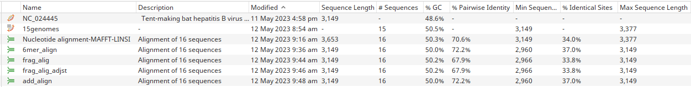
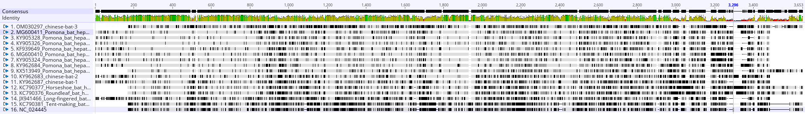
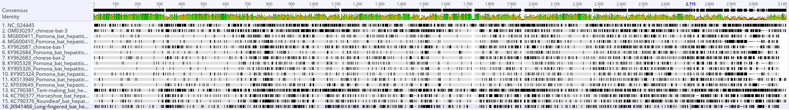

# Efficient Multiple Sequence Alignment (MSA) for closely related viral genomes - also applicable for circular genomes

## What

Sometimes is really difficult to align whole genomes because of several reason as poor sequenced extremities or circular genetic material constraints. One approach to deal with these difficulties is to use reference-based multiple sequence alignment (MSA) methods. 

## Why

Using a reference genome make the things easier! (And sometimes more accurate)

The MAFFT tool provides several options for MSA of closely related viral genomes. These include the "6merpair" option, which aligns sequences by comparing all 6-mers in a pair of sequences, the "add" option, which adds new sequences to an existing alignment, and the "addfragments" option, which aligns a set of sequences with a reference sequence by adding fragments of the sequences to the reference.  The "adjustdirection" option can also be used to adjust the direction of sequences to optimize the alignment.

## How

First, you need to have the MAFFT software version 7+ properly installed. Installation instructions could be find [here](https://mafft.cbrc.jp/alignment/software/).
Then, it is extremely recommended to have a reference that well-fit your alignment requirements!
	*This could be a NC_XXXX genomic sequence of your virus of interest.*
After that:
1. Depending on the number of genomes to align, use the standard accurate tool to align the genomes.
    1. Usually for few to several genomes, the LINSI algorithm from MAFFT runs with no time-constraint problems.
2. Mandatorily, try to run a MSA with just the `--add` flag.
3. Test making alignments with combinations of `--6mer`,  `--add`,  and `--addfragments` flags.
4. Sometimes, if you are unsure about the direction of your genetic sequence (forward ou reverse complement), use `--adjustdiirection` option.
5. To speed up the analysis, use most CPU threads you can and, if unsure, just use `--threads -1`.

***Generally, for highly conserved and closely-related genomes (~0.9 identity), `--6merpair` pair is recommended!***

**Otherwise, use it without the **`--6merpair`** and with **`--add` instead of `--adfragments`**: It’s suitable when the input sequences are less closely related, the sequences to be added are fewer and a reference MSA is available.**

The execution  of the commands bellow creates 4 different MSA. In all options,  '15genomes.fasta' is a fasta file with our target sequences and 'ref.fasta' is a fasta file containing the reference genome.

```bash

# 6mer
mafft --6merpair --thread 4 --keeplength --add '15genomes.fasta' 'ref.fasta' > '6mer_align.fasta'

#addfrag
mafft --6merpair --thread 4 --keeplength --addfragments '15genomes.fasta' 'ref.fasta' > 'frag_alig.fasta'

#adjust direction
mafft --adjustdirection --6merpair --thread 4 --keeplength --addfragments '15genomes.fasta' 'ref.fasta' > 'frag_alig_adjst.fasta'

#add only
mafft --thread 4 --keeplength --add '15genomes.fasta' 'ref.fasta' > 'add_align.fasta'
```

## Results

Using 15 hepatitis B virus genomes and a reference genome, after performing some alignments, one could obtain results like these:



We can see that:

- the `--add` flag provided MSAs with highest pairwise mean identity.
- in this case, using `--6merpair`  lead to lower % of identical sites.
- `--add`  without `--6merpair` lead to great pairwise mean identity and % of identical sites.

LINSI (most accurate) MSA:



`--add` reference-based MSA:



## Reference:

This is the user guide from MAFFT regarding the "add", "addfragment", and "6mer" options.

[MAFFT - a multiple sequence alignment program](https://mafft.cbrc.jp/alignment/software/closelyrelatedviralgenomes.html)

This page provides a more detailed explanation of the reference-based multiple sequence alignment (MSA) implemented in the MAFFT tool.

[Add new sequences to an existing alignment using MAFFT](https://mafft.cbrc.jp/alignment/server/add.html)

