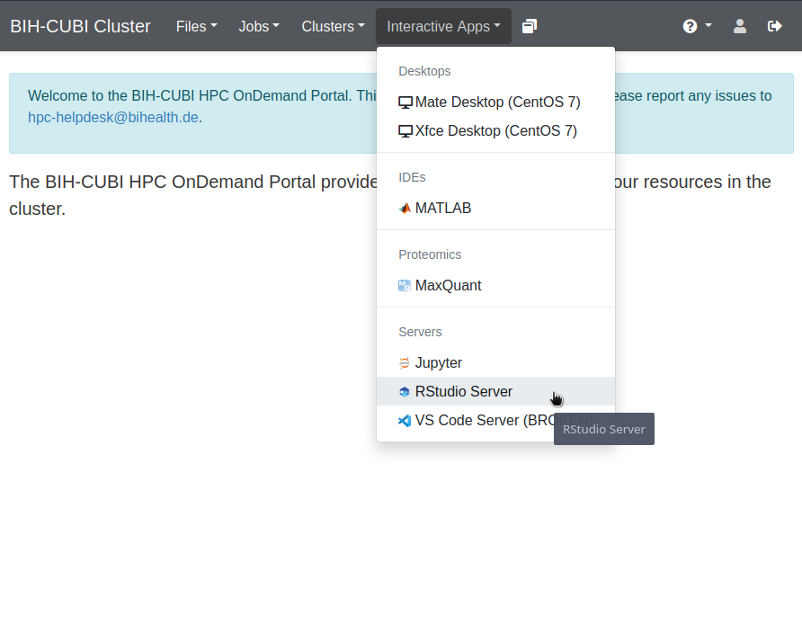
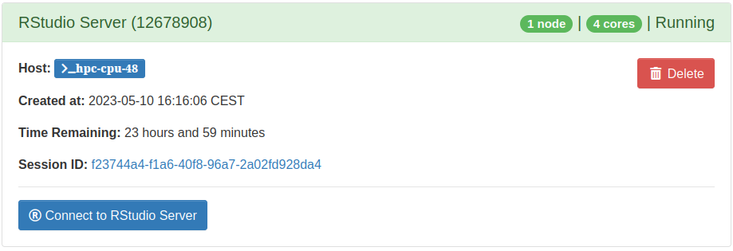

# Running RStudio on the BIH HPC cluster

## What

This document describes how to start an RStudio session from the BIH HPC
cluster.

## Why

Running RStudio on an HPC cluster has the advantage of using a IDE for
interactively working in R, while having access to the cluster's hardware. This
allows for more efficient work on resource-demanding computations, e. g.
RAM-intensive work as well as more advanced parallelization of tasks than would
be available on a personal computer. Additionally, the session allows direct
access to the HPC storage's personal storage as well as available `scratch` and
`work` directories.

## How 

The process of starting a session is straight-forward. Open the website of the
[BIH-CUBI HPC OnDemand Portal](https://hpc-portal.cubi.bihealth.org/), navigate
to `Interactive Apps` in the navigation bar and select `RStudio Server`.

<figure markdown>
  { width="800" }
  <figcaption>The OnDemand Portal</figcaption>
</figure>

In the following window, the default configuration can be left as is. For
computationally demanding tasks, more RAM or more CPU cores should be selected.
After pressing the `Launch`-button the resources for the session are requested
like with every other task submitted to the scheduler. After a short waiting
period, the session is ready and can be launched in a new tab by pressing the
`Connect to RStudio Server`-button.

<figure markdown>
  { width="800" }
  <figcaption>The RStudio session can now be launched</figcaption>
</figure>

## Results

An interactive RStudio session using cluster resources while having access to
the cluster file system has been started. 

## Further Reading

Further information is available at the BIH HPC cluster docs
[here](https://bihealth.github.io/bih-cluster/ondemand/overview/).
