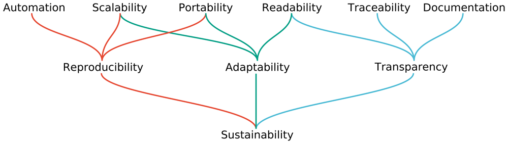
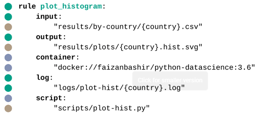
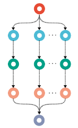
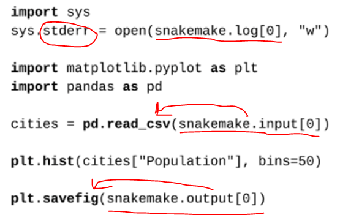
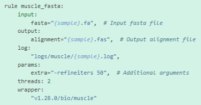
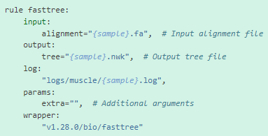
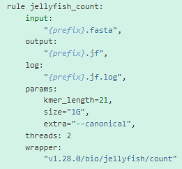

# Python’s SnakeMake

## Original Paper:

[F1000Research Article: Sustainable data analysis with Snakemake.](https://f1000research.com/articles/10-33/v2)

## Paper Study

Five niches of workflow managements:

1. Graphical
    1. Galaxy, knime, watchdog
    2. Shallow learning curve
    3. No programming skills needed
2. Classes and Functions
    1. applied in generic programming languages (python, scala…)
    2. scoop, comps, sciPipe, Anduril, balsam, pwrake, rufus
    3. no UI, could run in servers
    4. straightforward managed with git
3. DSL, Domain Specific Language
    1. nextflow, snakemake, bioqueue, Bpipe, clusterflow, Clyc, bigdatascript
    2. share advantages with the second class
    3. add readability
        1. DLS provides statements and declarations that specifies model central components
    4. SNAKEMAKE DSL is written in python, therefore access to the full power of the underling programming language is maintained
4. Declarative-way workflows
    1. POPPER
    2. use of declarative configuration files
    3. share clarity of the third niche, It stills readable for non-developers
    4. BUT it disallows imperative or functional programming
5. System-independent workflow languages
    1. CWL, WDL
    2. declarative syntax for specifying workflows
    3. It is less integrated into the specification language , limiting expressive power
    4. THEREFORE it is more scalable
    5. GREAT interoperability

Reproducibility insured by including deployment of the stack needed for each step (USING CONDA, DOCKER, singularity)



Well-DOCUMENTED code to make it ADAPTABLE

AUTOMATIC RUN to run it several times on lab

PORTABLE = it will run in any shit we install it with all required software

PARAMETRIC modules leads to REPRODUCIBILITY

## Rule

***It describes how to obtain a set of output files from a set of input files***

Conda can be used to describe the set of used software, or instead we can use a container-base as docker.

Example:

- Running a shell command within conda environment


- Running SCRIPT within container



Input or output files could be on local or stored at remote storage

The authors recommend the use of conda environment to develop pipelines, as it is fast and lightweight (YAML file). Once the tool is published, one can generate their own containers automatically by snakemake tools.

## Wildcards

In the context of Snakemake, a wildcard is a placeholder that allows you to generate dynamic rules and file paths based on patterns in your data. Wildcards are defined within curly braces **`{}`** and can be used in rule definitions, input and output file names, and other places where you want to create flexible and reusable workflows.

When you define a wildcard, Snakemake will automatically generate all possible combinations of values for that wildcard based on the available input files and the rules' dependencies. This allows you to create rules that can handle multiple input files with similar naming patterns and automatically generate output files based on those inputs.

Here's a simple example to illustrate the usage of a wildcard in a Snakemake workflow:

```
pythonCopy code
rule process_file:
    input:
        "input/{sample}.txt"
    output:
        "output/{sample}.processed.txt"
    shell:
        "process.py --input {input} --output {output}"
```

In this example, the wildcard **`{sample}`** is used to match any file name in the **`input`** directory with the **`.txt`** extension. For each input file, Snakemake will automatically generate a corresponding output file name by substituting the wildcard with the actual value. **The rule `process_file` will be applied to each pair of input and output files, enabling the processing of multiple files in parallel.**

By utilizing wildcards, Snakemake provides a flexible and scalable way to define rules and automate workflows that can handle varying input data.

It infers automatically all tasks will be needed for all of the input files implicitly declared by using wildcards. It is well represented by DAGs:



I also detects implicit dependencies between jobs!!!!!!

## Visualization of a DAG

To generate a visual representation of the DAG (Directed Acyclic Graph) from a Snakemake-encoded pipeline, you can use the **`snakemake --dag`** command. This command generates a graph in the DOT format, which can be converted into an image using Graphviz.

Here's the step-by-step process:

1. Open a terminal or command prompt.
2. Navigate to the directory where your Snakemake pipeline file (**`Snakefile`**) is located.
3. Run the following command to generate the DAG in DOT format:
    
    ```
    snakemake --dag | dot -Tsvg > dag.svg
    ```
    
This command pipes the DAG representation to the **`dot`** command (from Graphviz) and redirects the output to a file named **`dag.svg`**. You can replace **`dag.svg`** with any other desired filename or format (e.g., **`dag.png`**, **`dag.pdf`**).
    
4. Open the generated **`dag.svg`** file using an image viewer or web browser to visualize the DAG.

The resulting image will represent the workflow's DAG, illustrating the dependencies between rules and the flow of data in your Snakemake pipeline. Each rule will be represented as a node in the graph, and the directed edges will indicate the data flow between rules.

Note: Make sure you have Graphviz installed on your system before running the **`dot`** command. You can install Graphviz from the official website (**[https://graphviz.org/](https://graphviz.org/)**) or by using package managers like **`apt`**, **`brew`**, or **`conda`**, depending on your operating system.

## Script integration

The special `script` directive can be used to access and “pass global objects as arguments“ in python scripts called by rules. The code called will be able to access:
- input files
- output files
- wildcards values
- parameters
- etc.
    

    

    
## Tool wrapper
    
*WRAPPERs are python or R scripts that either uses libraries of the respective scripting language or calls a shell command.*
    
Each wrapper has its own dependencies and deals with their installations with conda environments.
    
In these cases, it is reccomended to running with the use conda flag:
    
> `snakemake --use-conda`
    
Basically, a wrapper can be used by simply copying and adapting a provided example rule. Snakemake possesses a huge repository of pre-defined wrappers.
    
For example, one can run bioinformatic tools simply by searching by its wrapper identification:
    
[Wrappers — Snakemake Wrappers tags/v1.28.0 documentation](https://snakemake-wrappers.readthedocs.io/en/stable/wrappers.html)
    
Some interesting wrappers:
    







    
## Job Scheduling
    
When running SnakeMake on the top of a middleware from, for example, a job scheduling system or a specific Cloud-based middleware, snakeMake does not govern resources anymore, but attribute this to the middleware: SnakeMake passes all information about job resource requirements (threads, memory, disk storage). Middleware chooses best machine for this.
    
Middleware examples:
- Slurn
- PBS
- LSF
- Kubernetes
    
### Running a snakemake with Slurm
There is a page in our institution's on how one could run a snakemake pipeline inside a given conda environment.
[BIH HPC Docs](https://bihealth.github.io/bih-cluster/slurm/snakemake/)
